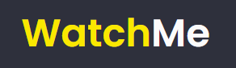

<div align="center" id="top"> 
  
</div>

<hr/>
<br>

## About 🛸

This project has the goal to show films according to the their categories.

## See how it works 📸


## Features

- SideBar is the place where you can select what type of films are you looking for.
- On the content side, you will the films that are available in the category selected.

## Technologies 👩‍💻

The following tools were used in this project:

- [React](https://pt-br.reactjs.org/)
- [TypeScript](https://www.typescriptlang.org/)
- [json-server](https://www.npmjs.com/package/json-server)
- [Axios](https://github.com/axios/axios)
- [Sass](https://sass-lang.com/)

## Requirements

Before starting 🏁, you need to have [Git](https://git-scm.com) and [Node](https://nodejs.org/en/) installed.

## Starting 🚀

```bash
# Clone this project
$ git clone https://github.com/Artur-Ceschin/Ignite-React-02.git

# Access
$ cd Ignite-React-02

# Install dependencies
$ yarn

# Run the project
$ yarn dev

# The server will initialize in the <http://localhost:3000>
```

## License📃

This project is under license from MIT. For more details, see the [LICENSE](./LICENSE.md) file.

Made with 💜 by <a href="https://github.com/Artur-Ceschin" target="_blank">Artur Ceschin</a>

&#xa0;

<a href="#top">Back to top</a>